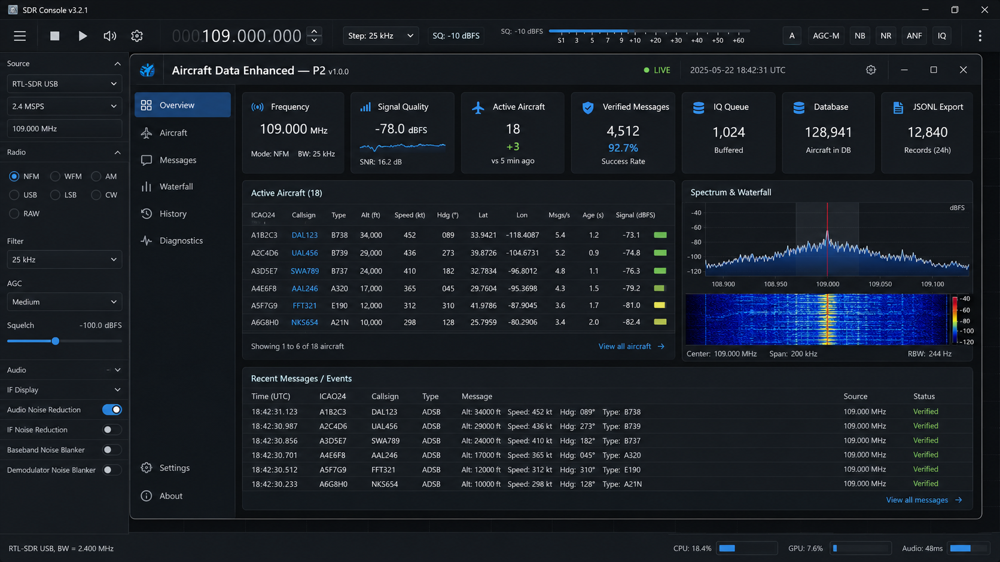
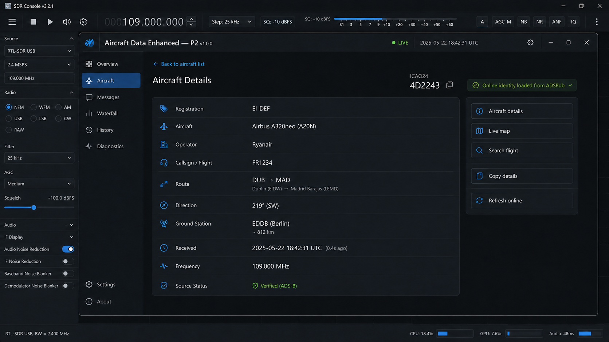
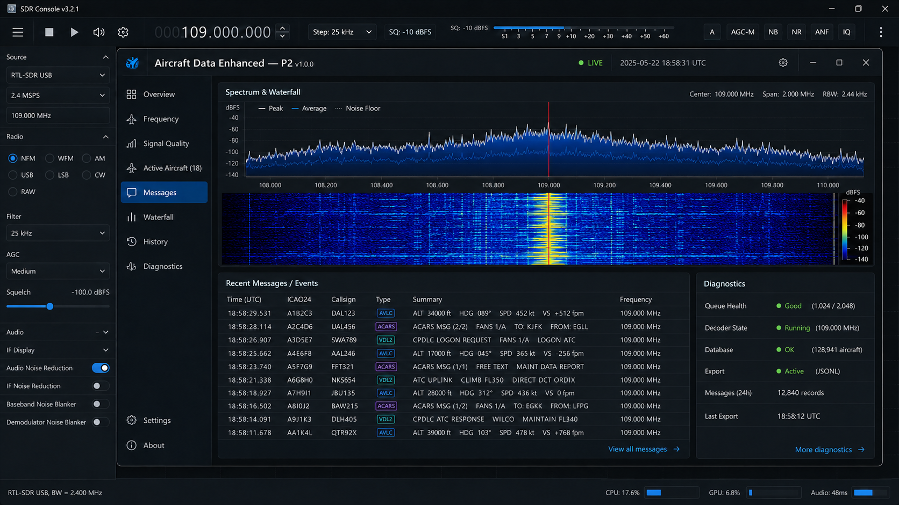

# Aircraft Data Enhanced v1.0.0 Stable

Receive-only VDL2, AVLC and ACARS monitoring plugin for SDR# .NET 9 on Windows x86.



## Highlights

- Native Windows Forms dashboard integrated into SDR#.
- Live VDL2/AVLC/ACARS decoding with verified-aircraft filtering.
- Active-aircraft sessions, message inspection and local SQLite history.
- Aircraft identity enrichment through ADSBdb with HexDB fallback.
- Spectrum and waterfall views driven by the plugin IQ pipeline.
- JSONL export with start/stop control from the main navigation.
- Settings toggle for the top status strip (`System Status`, `Decoder`, `Waterfall`, `Data`).
- Responsive full-width workspaces for Aircraft, Messages, History and Diagnostics.
- Receive-only design; no transmit/control path.

## UI previews

| Overview | Aircraft details | Messages and waterfall |
|---|---|---|
|  |  |  |

The images above are neutral UI previews and contain no usernames, local paths, receiver coordinates or captured user data.

## Requirements

- Windows x86 SDR# .NET 9 host.
- .NET SDK `9.0.316` for building from source.
- Python 3.10 or newer for validation scripts.
- Official **SDR# SDK for Plugin Developers** from Airspy.

The SDR# SDK DLLs are intentionally **not included** in this repository. Obtain the official SDK from `https://airspy.com/download/`, then place:

```text
lib/SDRSharp.Common.dll
lib/SDRSharp.Radio.dll
```

The stable SDK fingerprint currently validated for the production host is SDR# revision **1921**. See `sdk/approved-sdks.json` and `sdk/compatibility-matrix.json`.

## Build and install

1. Copy the two official SDR# SDK DLLs into `lib/`.
2. Confirm the exact host/SDK pair with `PREPARAR_SDK_ESTAVEL.ps1` only when the SDR# host or SDK changes.
3. Close SDR#.
4. Run:

```bat
BUILD_E_INSTALAR_TUDO.bat
```

5. Select the SDR# installation directory when requested.
6. Start SDR# and enable **Aircraft Data Enhanced**.

The build script runs the source validators, compiles the x86 solution, runs the C# regression suite, creates a binary manifest and installs the plugin into the selected SDR# `Plugins` directory.

## Validation status

The P2 core reached the stable gate after a formal 24-hour soak. The validated run completed with:

- 86,400+ seconds runtime;
- 1,286,810 IQ blocks received and processed;
- 0 dropped IQ blocks;
- 0 faulted IQ blocks;
- 1,286,810 buffers rented and returned;
- 160,851 valid JSONL records;
- 160,851 matching SQLite messages;
- SQLite `integrity_check=ok` and `quick_check=ok`;
- 0 waterfall frame drops.

Subsequent UI-only refinements were verified through builds, regression tests and interactive SDR# use. A new 24-hour soak is required only when the IQ pipeline, persistence layer or other long-running core behaviour changes.

## Repository layout

```text
src/        Core, Persistence and SDR# adapter
tests/      C# regression suite
tools/      validators, CI stubs and release tooling
testdata/   synthetic/golden test vectors
sdk/        compatibility metadata only
lib/        local SDR# SDK location; binaries are ignored
docs/       documentation and neutral UI previews
.github/    CI, issue templates and dependency automation
```

## Privacy and release hygiene

Public source releases exclude:

- SDR# proprietary SDK DLLs;
- usernames, personal email addresses and absolute user-profile paths;
- receiver coordinates and private configuration;
- runtime logs and aircraft lookup logs;
- SQLite databases and JSONL exports;
- IQ/audio/video captures;
- `bin`, `obj`, `.vs`, `artifacts` and Python caches.

Create a clean public archive with:

```powershell
.\PREPARAR_RELEASE_LIMPA.ps1
```

The script builds the release from a temporary staging copy, so it does not delete the local SDK DLLs from the developer workspace.

## Online enrichment

Aircraft identity enrichment may use ADSBdb and HexDB. These services are external to the project and can be unavailable, rate-limited, delayed or incomplete. The decoder and local history remain independent of successful online enrichment.

## Safety and scope

Aircraft Data Enhanced is a receive-only research/hobby tool. It is not an air-traffic-control, navigation, dispatch, emergency or safety-critical system. See `LEGAL.md`, `PRIVACY.md` and `SECURITY.md`.

## Licence

Project code is released under the licences identified by SPDX headers and the repository licence files. Third-party attributions are documented in `THIRD_PARTY_NOTICES.md` and `LICENSES/`.
